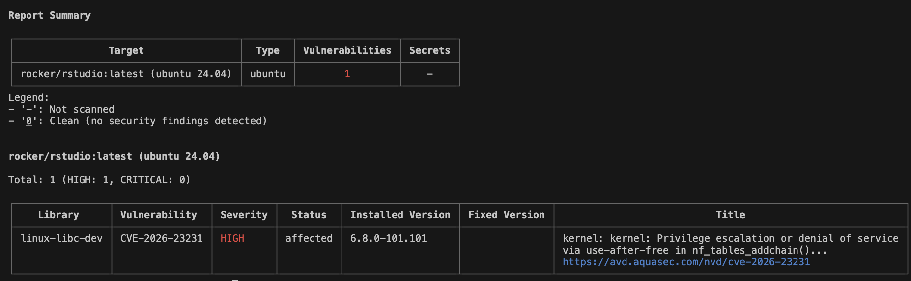
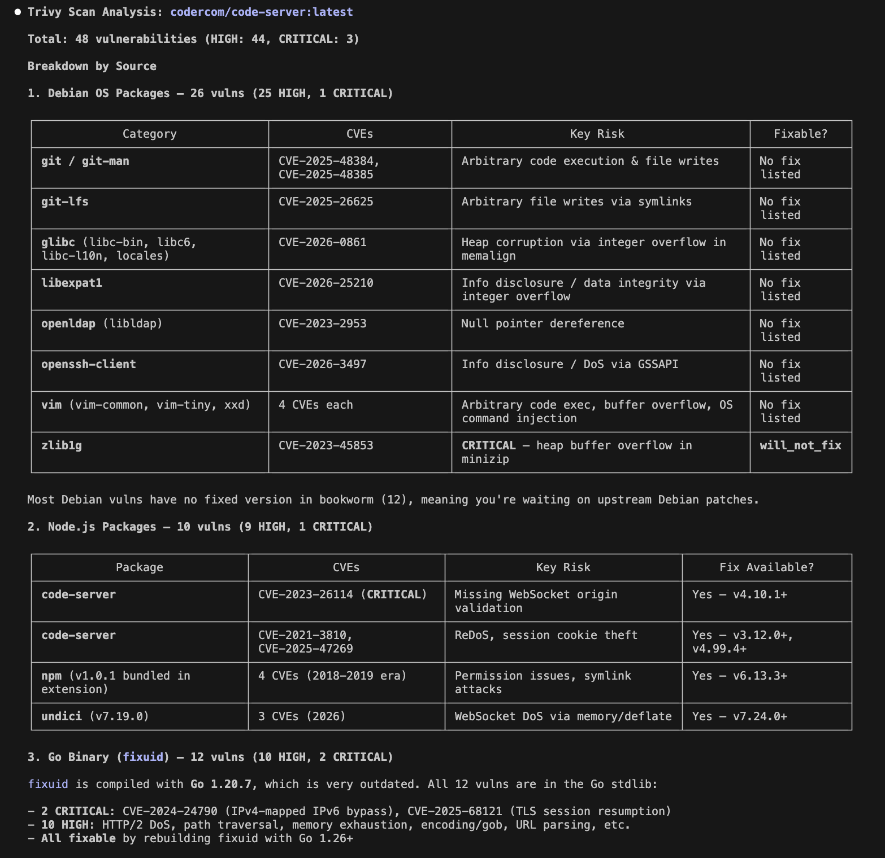
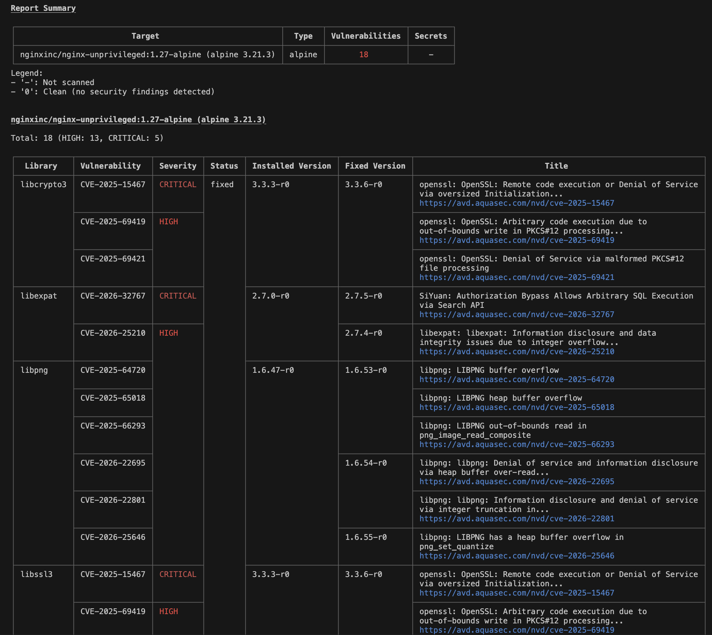

I have three images 
- rocker/rstudio 
- codercom/code-server
- image: nginxinc/nginx-unprivileged:1.27-alpine

All three have CVEs 

rocker/rstudio 
trivy image --severity HIGH,CRITICAL rocker/rstudio:latest 

codercom/code-server

nginxinc/nginx-unprivileged:1.27-alpine

2 goals
- the containers cannot be running as root
- we can't have any high or critical CVEs

Go ahead and come up with steps to handle this (dont recommend using third party hardened images)

---

## Remediation Plan

### 1. rocker/rstudio (1 HIGH)

**Current CVE:** `linux-libc-dev` (CVE-2026-23231) — kernel header package, no fix listed upstream.

**Steps:**
1. **Rebuild from a minimal base** (already started — see `minimal-cve-images/rstudio/Dockerfile`). Use `debian:trixie-slim` as the base and install only `r-base-core` + RStudio Server `.deb` directly.
2. **Multi-stage build** to keep build tools (`r-base-dev`, `libpq-dev`, `wget`, `gdebi-core`) out of the final image.
3. **Remove `linux-libc-dev`** — it's a build-time header package. It should not be in the runtime stage at all. If it's pulled in as a dependency, explicitly `apt-get remove` it after compilation.
4. **Run `apt-get update && apt-get upgrade -y`** in the final stage to pick up any patched OS packages.
5. **Run as non-root** — create a dedicated `rstudio` user, `chown` runtime dirs, and set `USER rstudio`.

### 2. codercom/code-server (44 HIGH, 3 CRITICAL)

Three sources of CVEs: Debian OS packages (26), Node.js packages (10), Go binary `fixuid` (12).

**Steps:**

#### a. Debian OS packages (26 vulns)
1. **Rebuild from `node:22-slim`** (or `debian:trixie-slim` + install Node) instead of using `codercom/code-server` as base. Install code-server via its standalone release tarball rather than their full image.
2. **`apt-get update && apt-get upgrade -y`** to pick up any available patches.
3. **Remove unnecessary packages** — `git-lfs`, `vim`, `openssh-client`, and other tools that ship in the upstream image but aren't needed at runtime. Fewer packages = fewer CVEs.
4. For packages with no fix listed (glibc, openldap, zlib1g) — removing them if unused, or accepting risk with a documented exception if they're required dependencies.

#### b. Node.js packages (10 vulns)
1. **Pin code-server to v4.10.1+** which fixes the CRITICAL WebSocket origin validation CVE (CVE-2023-26114).
2. **Update `undici`** to v7.24.0+ (fixes 3 WebSocket DoS CVEs).
3. **Remove or update bundled `npm` v1.0.1** in extensions — it carries 4 ancient CVEs. If extensions don't need it, delete it post-install.

#### c. Go binary — `fixuid` (12 vulns, 2 CRITICAL)
1. **Rebuild `fixuid` from source with Go 1.26+** (currently compiled with Go 1.20.7). All 12 CVEs are in the Go stdlib and are fixed in modern Go.
2. Alternatively, **remove `fixuid` entirely** if you're running with a fixed UID in Kubernetes (which you likely are). It's only needed for dynamic UID mapping in Docker.

#### d. Run as non-root
1. The upstream image has a `coder` user — keep `USER coder` as the final instruction (already done in current Dockerfile).

### 3. nginxinc/nginx-unprivileged:1.27-alpine (13 HIGH, 5 CRITICAL)

All 18 CVEs are in Alpine system libraries: `libcrypto3`/`libssl3` (OpenSSL), `libexpat`, `libpng`.

**Steps:**
1. **`apk update && apk upgrade --no-cache`** in the Dockerfile — all CVEs shown have fixed versions available in Alpine repos:
   - `libcrypto3`/`libssl3`: update to 3.3.6-r0 (fixes CVE-2025-15467 CRITICAL + HIGHs)
   - `libexpat`: update to 2.7.5-r0 (fixes CVE-2026-32767 CRITICAL + HIGH)
   - `libpng`: update to 1.6.55-r0 (fixes 6 buffer overflow CVEs)
2. **Pin the Alpine version tag** — use `nginxinc/nginx-unprivileged:1.27-alpine3.21` or later to get patched base packages.
3. **Already runs as non-root** — `nginx-unprivileged` runs as UID 101 by default. No changes needed.

### Summary

| Image | Strategy | Non-root | CVE Fix Path |
|-------|----------|----------|--------------|
| rocker/rstudio | Rebuild from `debian:trixie-slim` with multi-stage | Create `rstudio` user | Remove build-time packages from runtime image |
| codercom/code-server | Rebuild from slim base + standalone tarball, rebuild fixuid with modern Go | Keep `coder` user | Upgrade code-server, rebuild fixuid, strip unused OS packages |
| nginx-unprivileged | `apk upgrade` in Dockerfile | Already non-root | All fixes available — just update Alpine packages |